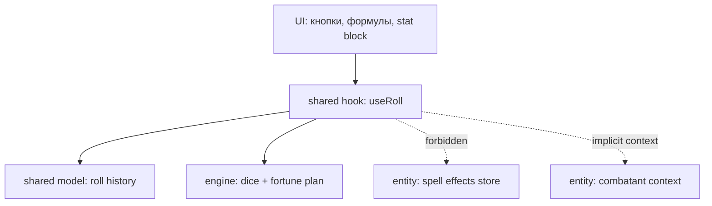
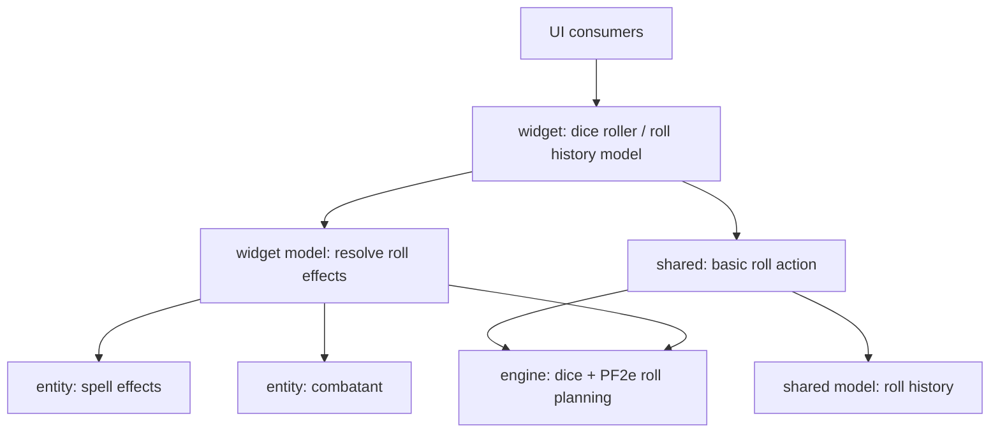
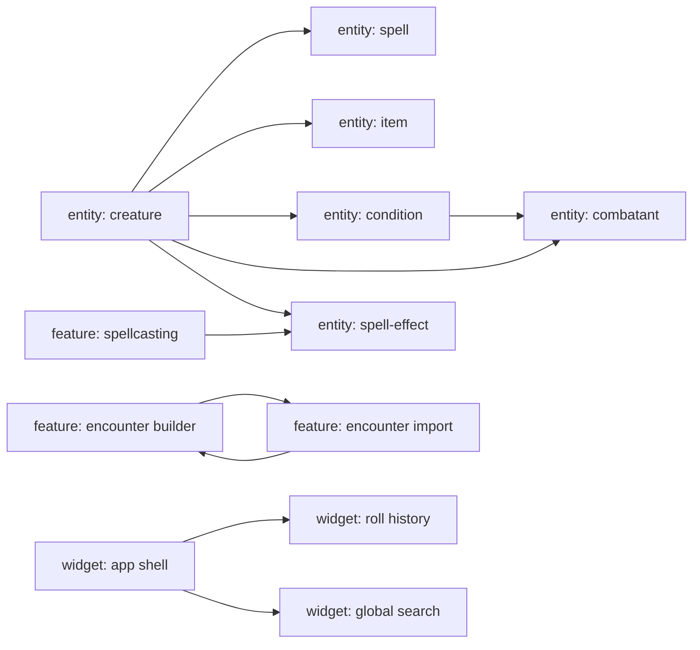
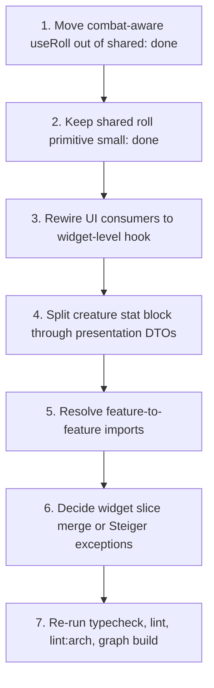

# PathMaid: архитектурные графы рефакторинга

Читатель: maintainer или новый разработчик, который выбирает следующий безопасный refactor slice.

Цель после чтения: понять, почему `useRoll` нужно вынести из `shared`, куда его переносить, и какие FSD-нарушения останутся после этого.

## Текущий запах

`useRoll` выглядит как shared hook, но фактически оркестрирует combat-level поведение. Он бросает формулу, пишет в историю бросков и читает активные эффекты combatant'а. Поэтому `shared` начинает зависеть от higher layer domain state.

Проблема не в том, что hook использует кубики. Проблема в том, что hook знает о боевом состоянии и эффектах, а это уже не уровень `shared`.

## Целевая раскладка бросков

`shared` должен остаться низкоуровневым: бросить формулу и сохранить результат. Combat-aware resolution должен жить выше, в widget slice, который собирает UI, roll history, combatant context и active effects.

Инвариант: `shared` не знает, почему бросок стал fortune/misfortune. Он только умеет исполнить уже подготовленный план или обычную формулу.

## Карта оставшихся FSD нарушений

После public API cleanup архитектурный gate сжат до 16 errors и 5 warnings. Оставшееся сгруппировано так:

`shared -> entities` для роллов уже убран. Следующий приоритет: разрезать creature hub, потому что он стягивает spell, item, combatant и spell-effect в один stat block boundary.

## Порядок атаки

`useRoll` is the next clean slice because it removes the last shared-layer upward dependency without touching the larger creature/spell coupling.

## Decision snapshot

Approved direction: treat `useRoll` as widget-level orchestration, not as shared infrastructure.

Keep in `shared`:

- dice execution primitives;
- roll history store;
- low-level UI primitives that do not know combat state.

Move above `shared`:

- active effect lookup;
- combatant-aware fortune/misfortune resolution;
- public `useRoll` hook used by combat-facing UI.
